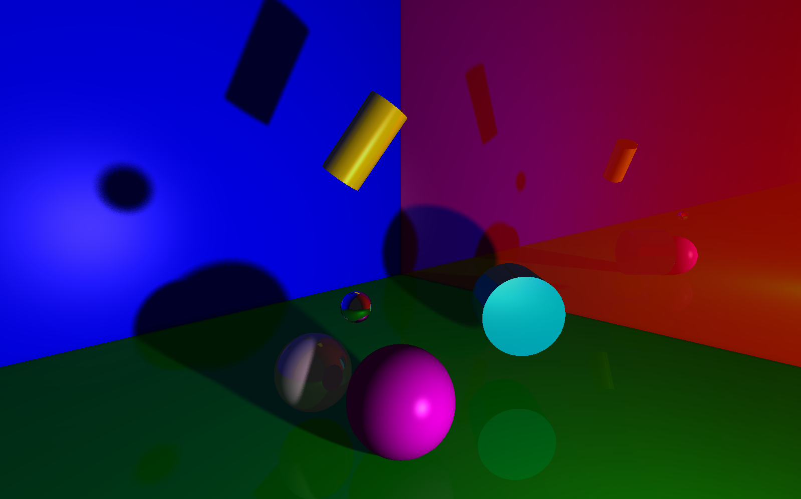
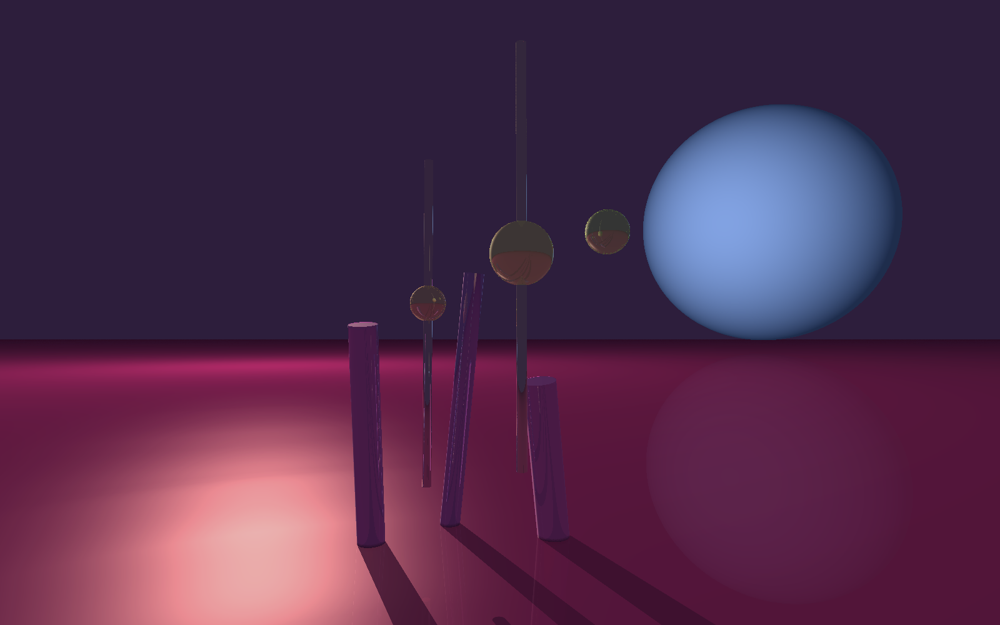
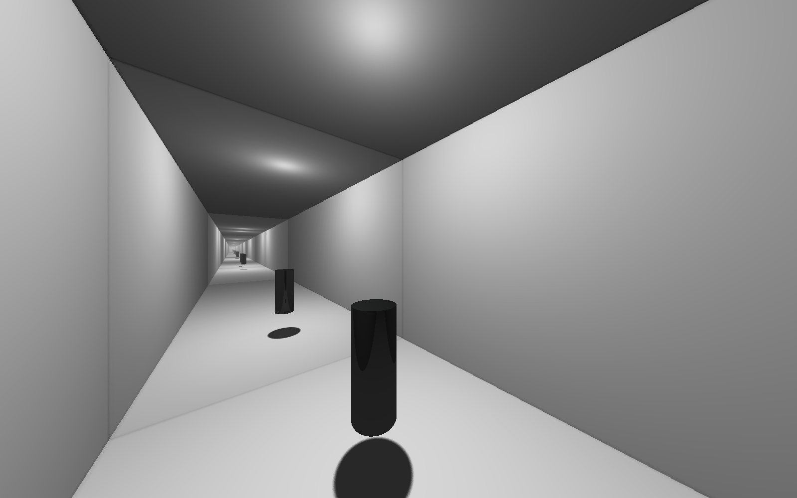
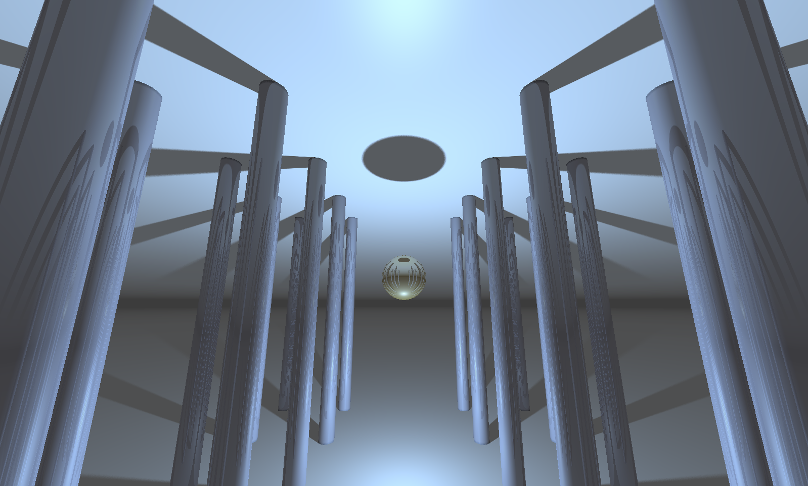
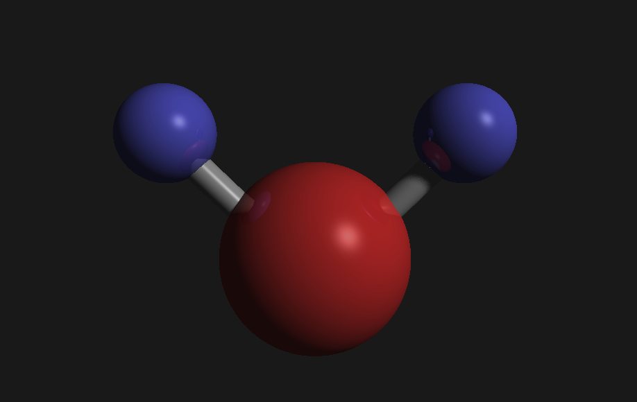
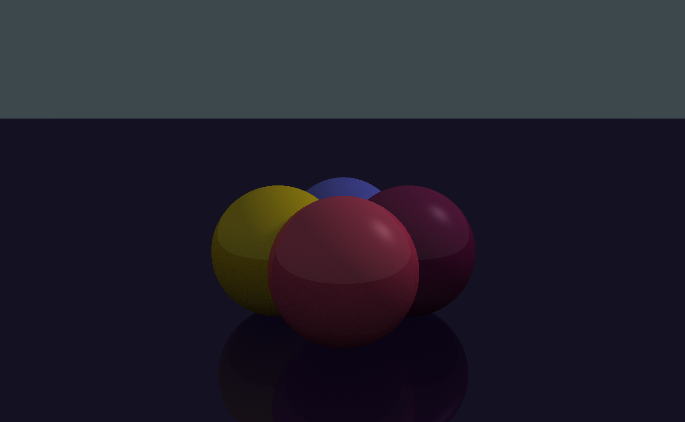
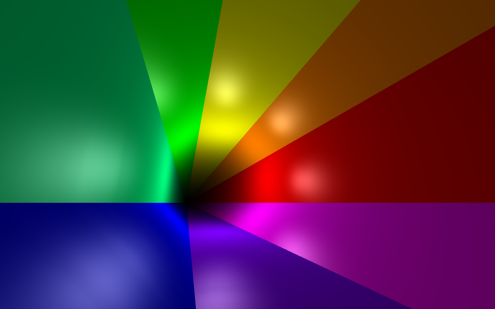

<div align="center">
  <h1>
    🌟 miniRT (42 project)
  </h1>
  <p>
    <b><i>Basic ray-tracing engine written in C using the MLX42 graphics library.</i></b>
  </p>
</div>



_This project was made in collaboration with [Cimex](https://github.com/Cimex404). He has uploaded it as his own repository as well!_

## About
MiniRT is a basic 3D ray-tracer that uses the MLX42 graphical library (OpenGL windows) to render a scene based off a scene file containing camera, light and object data.\
It works by casting a ray for each screen pixel out of the camera and calculating intersections with objects in 3D space. The objects have surface normals that dictate the ray should behave when bouncing back to the light source. The scene currently can only have one point light and all rays trace back to it. Shadows are calculated in two different ways; shadow rays and ambient occlusion. Shadow rays are generated where the ray hits an object and cannot continue, simulating how the shadow would be cast onto whichever surface it occluded. Ambient occlusion on the other hand is purely proximity-based between two very close objects and simulates how light gets trapped in tight spaces and diffuses into darkness. Both of these shading processes use samples and pseudo-random scatter to simulate diffusion. The higher the samples the less noisy the shadows look in exchange for computation time. Additionally, some extra visual features have been implemented, as well as basic run-time user controls. Memory is handled with a rudimentary garbage collection system and there is a robust logging and error handling system for convenience.\
Despite being a project for 42, the latest and all future version will deviate from **the norm**. If you wish to see a fully norm-compatible version that we submitted, check the commit history for that point in development!

## Features
- **Primitive Assets:**\
	Currently the project features three primitive objects: planes, spheres and cylinders. Each have unique parameters that can be set in the scene file. More info in _Usage_.
- **Lighting:**\
	The scene is lit by two sources, an ambient light and a point light. The ambient light acts as a global illumination and also controls the base atmosphere color where no objects are hit (like a skylight in other 3D software). The point light is a single point out of which light is cast. It is currently invisible on its own and only casts light onto objects directly. It also has a fall-off distance and does not cast shadows indefinitely far away.
- **Roughness:**\
	To simulate different materials, we implemented a roughness index which can be optionally tweaked for every object. This roughness will determine how much of a specular highlight forms at the point in the object in which the surface normal directly reflects light rays back into the camera.
- **Reflections:**\
	Some basic reflections have been implemented and each object has an optional reflectivity index, much like roughness. The maximum reflections are set as a constant in each preset, with the highest quality allowing up to 100 reflections.
- **User Input:**\
	Key hooks have been added to allow for some user input. The controls allow you to move, rotate and change thw shadow sample dynamically.
	Keybinds:
	- `w` - move forward
	- `s` - move backward
	- `a` - move left
	- `d` - move right
	- `↑` - rotate up (until looking straight up)
	- `↓` - rotate down (until looking straight down)
	- `←` and `→` - rotate left and right respectively (loops back around)
	- Numpad `+` and `-` - increase/decrease shadow samples by 16 (from a range of 1 to 112)
- **Quality Presets:**\
	In order to test scenes easily I have made three different quality presets that change the default samples, maximum reflections and window dimensions. The three presets are:
	- _Standard_ - 800 x 500, 64 samples, 50 reflections (a nice balance, samples can be lowered manually for slow movement)
	- _Low_ - 320 x 200, 1 sample, 1 reflection (allows smooth movement around the scene at the cost of poor quality)
	- _High_ - 1600 x 1000, 80 samples, 100 reflections (for high quality renders, movement is essentially impossible)
	To change the quality, you can compile with `make QUALITY=LOW` or `QUALITY=HIGH`. If compiled without this flag it will default to standard quality.
- **Logging System:**\
	The program logs all objects when parsing them and reports any issues with warnings or errors as they are found. When rendering it also displays the percentage of processed pixels in intervals of 10.

## Usage
You can simply compile with `make`. To clean binaries use `make clean` or `make fclean` for a full wipe of the executable. You can also specify the quality as previously described.
To run miniRT on a scene you must use this command:

```bash
./miniRT "[scene file / path to scene file]"
```

The scene file must have the `.rt` extension and must follow a specific format:
- The scene _must_ include a single ambient light (`A`), a single camera (`C`) and a single point light (`L`).
- The **ambient light** parameters are `intensity` from 0 to 1 as a float and `color` in RGB format as three values from 0 to 255. _Color works this way for all assets._
- The **camera** parameters are `position` x,y,z `rotation` x,y,z as values from -1 to 1 and `focal length` or FOV as a value from 1 to 180.
- The **point light** parameters are `position` x,y,z as well as intensity and color in the same format as the ambient light.
- The scene can have any amount of objects out of a selection of **planes** (`pl`), **spheres** (`sp`) and **cylinders** (`cy`).
- Planes extend infinitely and have a single normal that points in the direction of their rotation vector. They have `position` x,y,z `rotation` x,y,z and `color`.
- Spheres have `position` like all other objects, no rotation as it has no effect on the a sphere, `diameter` as a float and `color`, as per usual.
- Cylinders have `position` and `rotation` in the usual format as well as `diameter`, `height` and `color`.
- If any of these objects parameters is missing, in the wrong order or otherwise invalid the object will be ignored and not rendered. If the mandatory assets (ambient, camera and point light) are missing or invalid the window will not launch at all.
- For all objects, in addition to their necessary parameters you can also add `roughness` and `reflectivity` as floats from 0 to 1 in that order. If not added, these parameters will default to some preset values.
- The parameters can be space-separated as much as you like and have any empty lines between assets. Any unrecognized assets will be ignored.
- You can also add commented lines to the scene file. To do this, simply add a `#` to the **start** of the line.

An example scene would look like this:
```rt
#AST  POSITION        ROTATION    LUM/FOV RAD HGT  COLOR       ROUGH REFLECT
A                                 0.1              240,255,255
C    -50,40.5,50      1,-0.25,-1  62
L    -5,10,60                     0.84             255,196,240

pl   0,-10,0          0,1,0                        0,255,0     0     0.4
pl   100,0,0          -1,0,0                       255,0,0     0     0
pl   0,0,-100         0,0,1                        0,0,255     0     0
sp   0,0,0                                20       255,0,255   0.8   0
sp   -10,20,0                             5        10,20,30    0     0.8
cy   10,40,-30        .5,1,.5             10 20    255,255,0
cy   50.0,7,-8        -1,0,1              20 15.5  0,255,255
sp   -5,0,-21                             16       255,255,255 0
```

**NOTE:** The project depends on my [libft](https://github.com/N03l-MG/libft) utilities library as well as [MLX42](https://github.com/codam-coding-college/MLX42) for graphics. Both are added as submodules in the repository.

## Render Gallery







## Future Plans
This project has undoubtedly been my favorite from the 42 core curriculum so far. I look forward to adding many advanced features, _though no longer strictly following the 42 norm or project rules_.
Here is a list of the features I would like to add:
- Performance improvements such as multi-threading and GPU delegation. Potentially bounding volume hierarchy.
- Bloom to the point light, such that we can see where it is exactly.
- Better handling of large scenes where the shadows are cast long distances.
- A cuboid primitive object.
- Support for the **obj** 3D format, allowing for rendering of any 3D model.
- _Maybe_ light refraction and caustics.
- Bump-mapping and textures.
- _If I'm feeling crazy_, a way to edit the assets dynamically during runtime.
